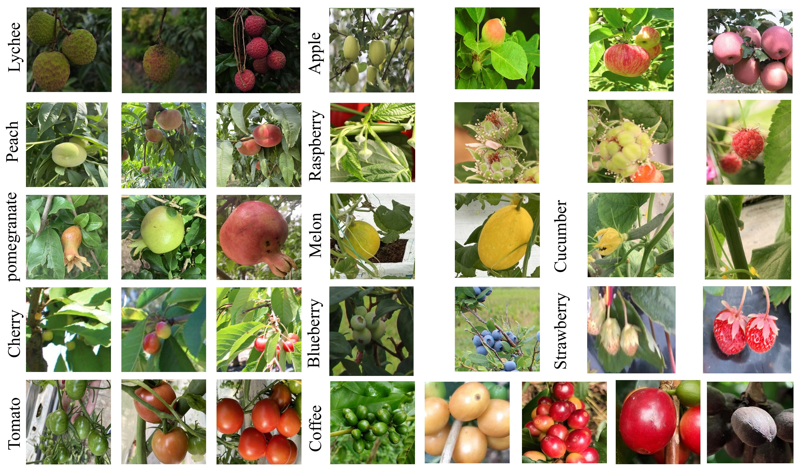

# CDFRB: A Large-Scale Benchmark and A Robust Deep Learning Model for In-the-Wild Fruit Ripeness Detection

---

## Abstract
Accurately grading the maturity of multiple fruit types in an uncontrolled orchard environment is key to automated harvesting, but this is limited by the gap between category diversity and scene realism in existing datasets. To address this challenge, this paper first constructs and proposes the first large-scale fruit maturity benchmark CDFRB that balances diversity and realism. On this basis, we further design a new detection model called MaturNet. Extensive experiments on the CDFRB benchmark show that MaturNet's overall performance significantly outperforms existing mainstream general-purpose detectors. Our work provides a solid foundation and high-performance baseline model for general fruit maturity detection research in real-world environments.

## The CDFRB Dataset

### Download

The dataset used in this study will be made publicly available in a repository upon acceptance of the manuscript.

* **Baidu Drive**: [**[link](https://pan.baidu.com/s/1z3g1tz_BbYiX2OEwgv_VCg?pwd=8f5v)**]
* **Google Drive**: [**[link](https://drive.google.com/file/d/1CrA3OIVRFXS1CjehAUZOI1yjgHVXjn-Y/view?usp=sharing)**]

### Composition

CDFRB was constructed by integrating 12 publicly available fruit datasets annotated with maturity levels, ultimately forming a hierarchical labeling system with 36 independent categories.

**Table 1. Fruit categories and their maturity levels in the CDFRB.**

| Fruit Category | Maturity Levels | Number of levels |
| :--- | :--- | :---: |
| Apple | `Pre_growth`, `Young`, `Late_growth`, `ripe` | 4 |
| Blueberry | `unripe`, `ripe` | 2 |
| Cherry | `unripe`, `semi_ripe`, `ripe`, `green` | 4 |
| Coffee Fruit | `dry`, `overripe`, `ripe`, `semi_ripe`, `unripe`| 5 |
| Cucumber | `unripe`, `ripe` | 2 |
| Lichi | `green`, `semi_ripe`, `ripe` | 3 |
| Melon | `unripe`, `ripe` | 2 |
| Peach | `unripe`, `semi_ripe`, `ripe` | 3 |
| Pomegranate | `unripe`, `semi_ripe`, `ripe` | 3 |
| Raspberry | `unripe`, `Growing`, `semi_ripe`, `ripe` | 4 |
| Strawberries | `unripe`, `ripe` | 2 |
| Tomato | `unripe`, `semi_ripe`, `ripe` | 3 |
| **Total** | | **36** |

### Visualization

The figure below shows examples of 12 fruits in the CDFRB dataset at different stages of maturity.



## Main Results

We compare the performance of our model MaturNet with various mainstream detectors on the CDFRB benchmark.

**Table 2. Performance comparison of different detectors on the CDFRB dataset.**

| Model | AP (%) | APs (%) | APm (%) | APl (%) | #Param.(M) | FLOPs(G) |
| :--- | :---: | :---: | :---: | :---: | :---: | :---: |
| YOLOv8n | 60.1 | 28.1 | 58.0 | 74.0 | 2.69 | 6.90 |
| YOLOv11n | 59.6 | 27.6 | 56.7 | 74.6 | 2.59 | 6.40 |
| YOLOv12n | 60.4 | 29.0 | 57.9 | 74.5 | **2.52** | **5.90** |
| YOLOv13n | 59.1 | 26.8 | 56.1 | 74.2 | 19.92 | 57.10 |
| RT-DETR-r18 | 56.9 | 27.2 | 60.5 | 81.6 | 19.92 | 57.10 |
| DAB-DETR | 56.7 | 24.6 | 55.2 | 73.4 | 43.71 | 72.13 |
| Condition-DETR | 49.3 | 15.0 | 46.1 | 68.3 | 41.56 | 67.17 |
| Faster R-CNN | 56.0 | 25.9 | 54.6 | 69.9 | 41.53 | 148.00 |
| **MaturNet(Ours)** | **62.6** | **31.4** | **60.7** | **76.2** | 2.83 | 8.5 |

```

